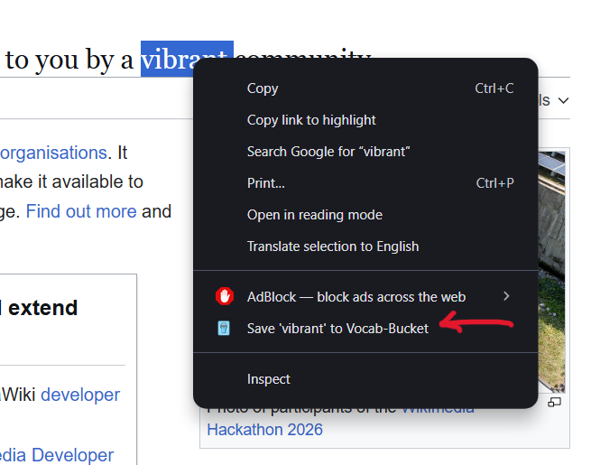
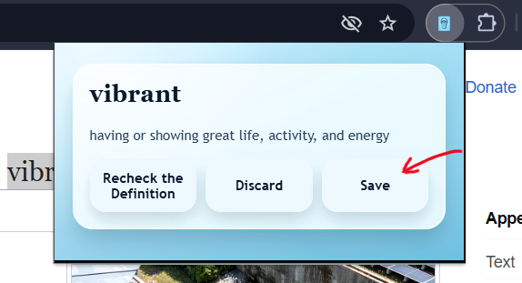
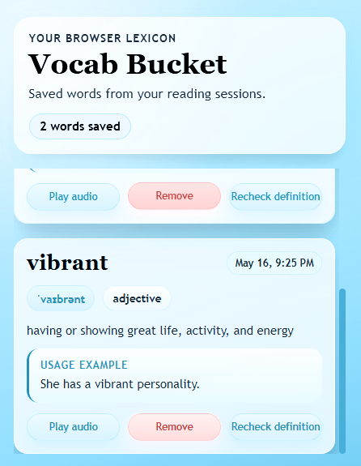
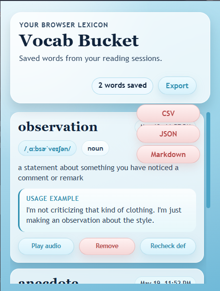
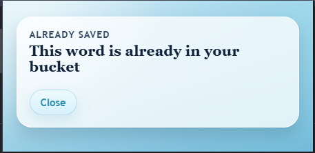
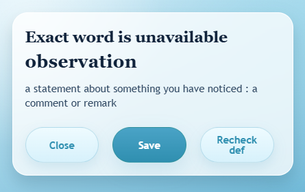

# Vocab Bucket - Technical Documentation

## 1. Introduction

### Overview

**Vocab Bucket** is a Manifest V3 Chrome Extension designed to serve as a personal, in-browser lexicon. It allows users to capture, define, and save English vocabulary seamlessly while reading web content. By integrating with the Merriam-Webster Learner's API, the extension provides accessible definitions, phonetic pronunciations, and contextual usage examples right inside the browser, saving them to a personalized "bucket" for future review.

### Who is this for?

This extension is tailored for ESL (English as a Second Language) students, avid readers, and lifelong learners who want a distraction-free way to look up and store new vocabulary without leaving their current tab.

### Interfaces








### Tech Used

| Technology | Purpose in Project |
| --- | --- |
| **JavaScript (ES6+)** | Core logic, asynchronous DOM manipulation, and Service Worker background tasks. |
| **Manifest V3 API** | Modern Chrome Extension architecture, handling permissions, shortcuts, and message passing. |
| **HTML5 & CSS3** | Structures and styles the elegant extension Popup and Lexicon UI. |
| **Merriam-Webster API** | Primary data provider returning definitions, phonetics, and usage examples via JSON. |
| **chrome.storage API** | Persists the user's saved vocabulary bucket across browser sessions. |

### Capabilities

* **Quick Capture via Shortcut:** Users can instantly trigger a word lookup using the `Alt + Ctrl + S` keyboard shortcut.
* **Omnibox Integration:** Search for words natively via Chrome's address bar.
* **Smart Auto-Correction:** Automatically fetches the right definition even if you misspell a word or if Google redirects the query.
* **Interactive Definition Dialog:** Before saving, a preview card (e.g., for the word "simplify") allows users to read the basic meaning and choose to **Save**, **Discard**, or **Recheck the Definition**.
* **Browser Lexicon Dashboard:** A beautiful, scrollable UI that displays the count of saved words and detailed vocabulary cards.
* **Rich Vocabulary Cards:** Saved words display phonetic spellings (e.g., `/ˈpəmənənt/`), parts of speech (e.g., `adjective`), comprehensive definitions, and contextual usage examples.
* **Audio Pronunciation:** Users can click "Play audio" to hear how a word is spoken.
* **Bucket Management:** Instantly remove words from the lexicon when they are mastered.

### Future Improvements & Checklist

* [x] Core extension architecture (Manifest V3) and popup UI.
* [x] Merriam-Webster API integration for rich word data and audio.
* [x] Keyboard shortcut listener (`Alt + Ctrl + S`).
* [ ] **Implement "Recheck definition":** Build a fallback scraper to search Google for "define [word]" if the primary API fails or yields unsatisfactory results.
* [ ] Implement a Node.js/Express backend proxy to completely hide the API key from the browser environment.
* [ ] Add a JavaScript-driven Flashcard or Quiz mode to test saved vocabulary.
* [X] Support exporting saved words into multiple different formats such as `.json`, `.csv`, `.md`.
* [ ] **Shortcut Conflict Handling:** Add a settings menu allowing users to remap the `Alt + Ctrl + S` shortcut in case it conflicts with native OS or other app shortcuts.
* [ ] **Cloud Sync:** Transition from `chrome.storage.local` to `chrome.storage.sync` so users can access their Vocab Bucket across different devices logged into Chrome.

---

## 2. Advanced Search Features

Vocab Bucket goes beyond simple page scraping and popup clicks, offering advanced, frictionless ways to capture vocabulary directly from your browser.

### Omnibox (Address Bar) Integration

You don't even need to click the extension icon to search for a word! Vocab Bucket natively integrates with Chrome's address bar (the Omnibox).

* **How to use it:** Simply click into your Chrome address bar, type the letters `vb`, and hit the `Tab` or `Space` key. Your address bar will transform into a Vocab Bucket search input. Type any word and press `Enter` to instantly look it up and add it to your Lexicon.
* **The Breakdown:** *Under the hood, this utilizes the Manifest V3 `chrome.omnibox` API. When you type the keyword (`vb`), Chrome intercepts the input and wakes up our `background.js` Service Worker. The Service Worker listens for the `chrome.omnibox.onInputEntered` event, grabs the string you typed, fetches the definition, and handles the save logic seamlessly.*

### Smart Auto-Correction Fetching

English spelling can be tricky, but Vocab Bucket has your back. If you attempt to look up a misspelled word, the extension features intelligent auto-correction handling. It detects if google automatically corrected a word then prompts the user to save that word 

---

## 3. Project File Structure

Vocab Bucket is built with a modular, scalable ES6 architecture. Here is a breakdown of the codebase to help contributors navigate the project.

```text
VOCAB-BUCKET/
├── background/
│   └── background.js
├── core/
│   ├── VocabularyExtractor.js
│   └── WordHandler.js
├── images/
│   └── icons/
├── popup/
│   ├── main.css
│   ├── main.html
│   ├── main.js
│   └── flash/
│       ├── already_saved/
│       │   ├── script.js
│       │   ├── struct.html
│       │   └── style.css
│       └── word_unavailable/
│           ├── script.js
│           ├── struct.html
│           └── style.css
├── save_conf/
│   ├── script.js
│   ├── struct.html
│   └── style.css
├── styles/
│   └── shared.css
├── scripts/
│   └── content.js
├── tutorial/
├── config.example.js
├── config.js
├── LICENSE
├── manifest.json
├── package.json
└── README.md

```

#### The Breakdown: Why the `core/` folder?

*In JavaScript architecture, separation of concerns is vital. By placing files like `VocabularyExtractor.js` and `WordHandler.js` in a dedicated `core/` folder, we decouple our business logic (fetching, parsing, validating) from our UI logic (`popup/`) and our event listeners (`background/`). This means if the Merriam-Webster API changes its JSON structure tomorrow, you only have to update the `VocabularyExtractor.js` file, leaving the rest of the extension completely intact!*

---

## 4. Configuration Guide

To run and test **Vocab Bucket** locally in your browser, follow these steps.

### Local Setup (Load Unpacked Extension)

1. Clone the repository to your local machine: `git clone https://github.com/banuka20431/vocab-bucket.git`
2. Open Google Chrome and navigate to your extensions page by typing `chrome://extensions/` in the URL bar.
3. Toggle the **Developer mode** switch in the top right corner.
4. Click the **Load unpacked** button in the top left.
5. Select the `vocab-bucket` directory you just cloned. The extension should now appear in your browser!

> **⚠️ Note on Keyboard Shortcuts:** The default trigger for capturing a word is `Alt + Ctrl + S`. If this shortcut does not work, it may be conflicting with a system-level shortcut on your OS. You can manually adjust extension shortcuts in Chrome by navigating to `chrome://extensions/shortcuts`.

### Node Dependencies Setup

While the extension runs entirely in the browser, a Node environment is used for type-hinting and API key management during development.

1. **Open your terminal** and navigate to the project root directory.
2. **Install the developer dependencies** by running:
```bash
npm install

```


* **The Breakdown:** The `package.json` includes `@types/chrome` and `@types/node` as Dev Dependencies. Even though we write vanilla JavaScript, these packages provide your code editor (like VS Code) with rich IntelliSense and auto-completion for complex `chrome.*` Manifest V3 APIs!

### API Key Configuration

Vocab Bucket relies on the Merriam-Webster Learner's Dictionary API to fetch word data.

1. Navigate to the [Merriam-Webster Developer Center](https://dictionaryapi.com/) and register for a free account.
2. Request a new key, ensuring you select the **"Merriam-Webster's Learner's Dictionary"**.
3. In the root directory of your cloned project, locate `config.example.js`.
4. Rename this file to `config.js`. *(Keep this file out of version control!)*
5. Paste your API key into the file:
```javascript
const API_KEY = "YOUR_COPIED_API_KEY_HERE";

```


6. Return to `chrome://extensions/` and click the refresh icon (↺) on the Vocab Bucket card to reload the extension with your new config.

---

## 5. Contribution Guidelines

We welcome contributions! Whether you are styling the Lexicon UI or optimizing Service Worker fetch requests, please adhere to the following workflow.

### How to Contribute

1. Fork this repository and clone it locally.
2. Create a new branch strictly following our naming convention (see below).
3. Develop your feature, ensuring all UI elements match the existing design system.
4. Push your changes and open a Pull Request (PR) against the main branch.

### Contributor Rules

* **Manifest V3 Compliance:** Do not introduce Manifest V2 code (e.g., standard background pages). All background scripts must operate as Service Workers.
* **Scraping Caution:** If working on the "Recheck definition" feature, ensure any Google search scraping logic respects CORS policies and is executed correctly within the extension's permission scope.
* **Documentation:** Comment complex logic blocks using JSDoc, especially message passing between content scripts and the popup.

### Branch Naming Convention

All branches must follow this exact pattern: `dev/[name]`

**Valid Examples:**

* `dev/feature-google-scraper`
* `dev/fix-audio-playback`
* `dev/update-manifest-permissions`

This is an incredibly important addition! If you plan to publish Vocab Bucket to the Chrome Web Store, having a clear, transparent Privacy Policy isn't just a best practice—it's a strict requirement from Google, especially when handling user input like search queries.

Here is the **Privacy Policy & Data Handling** section, written professionally and accurately reflecting your extension's Manifest V3 architecture. You can add this right at the end of your documentation.

---

## 6. Privacy Policy & Data Handling

At **Vocab Bucket**, we believe that your learning journey is personal. We are committed to protecting your privacy and ensuring complete transparency regarding how your data is handled.

### Data Collection & Monitoring

* **No Remote Monitoring:** Vocab Bucket does **not** monitor, collect, log, or transmit your reading habits, webpage content, or general search phrases to any remote servers owned by the developers.
* **Omnibox Searches:** When you use the Omnibox integration (`vb` + `Tab`), the search phrase you type is intercepted locally by the extension's Service Worker to execute the word lookup. We do not track, store, or monitor these queries remotely.
* **API Routing:** To provide definitions, the specific word you search for is sent directly to the Merriam-Webster API. No personally identifiable information (PII) is attached to these requests.

### Local Storage

All vocabulary words, definitions, and usage examples saved to your "bucket" are stored entirely locally on your machine using Chrome's native `chrome.storage.local` API. Your personal lexicon never leaves your device unless you actively choose to export it.

### Required Permissions Justification

To function correctly, the extension requests the following permissions in the `manifest.json`, used strictly for their stated purpose:

* `storage`: To save your vocabulary list locally.
* `activeTab`: To temporarily inject the "simplify" capture UI onto the specific page you are currently reading.
* `omnibox`: To allow direct word searches from the Chrome address bar.
